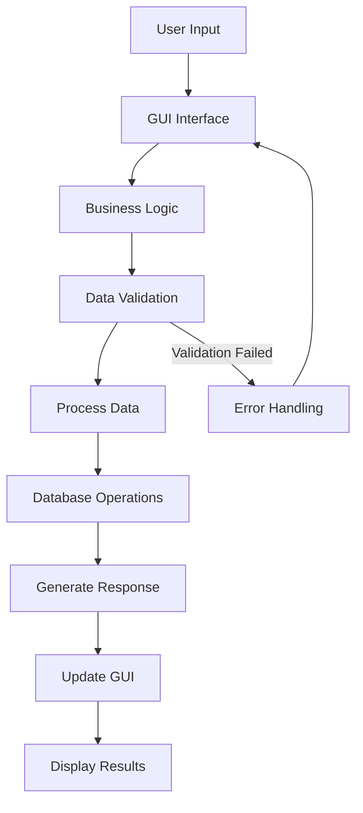

# Student Management System

<div align="center">


**Sistem Manajemen Data Mahasiswa Berbasis Desktop Modern**

</div>

## 📋 Daftar Isi

- [Gambaran Umum](#-gambaran-umum)
- [Arsitektur Sistem](#-arsitektur-sistem)
- [Fitur Utama](#-fitur-utama)
- [Instalasi & Setup](#-instalasi--setup)
- [Panduan Penggunaan](#-panduan-penggunaan)
- [API & Konfigurasi](#-api--konfigurasi)
- [Troubleshooting](#-troubleshooting)

## 🎯 Gambaran Umum

Student Management System adalah solusi lengkap untuk mengelola data mahasiswa di institusi pendidikan. Aplikasi ini dibangun dengan teknologi modern untuk memberikan pengalaman pengguna yang optimal dan efisien.

### Target Pengguna
- 🏫 Administrator Kampus
- 📊 Staff Administrasi Akademik  
- 🎓 Dosen dan Penasihat Akademik
- 💻 Departemen IT Pendidikan

## 🏗 Arsitektur Sistem

### Layer Architecture
```
┌─────────────────────────────────────────────┐
│            PRESENTATION LAYER               │
│              (PyQt5 GUI)                    │
├─────────────────────────────────────────────┤
│            BUSINESS LOGIC LAYER             │
│           (Python Core Logic)               │
├─────────────────────────────────────────────┤
│            DATA ACCESS LAYER                │
│           (JSON Database)                   │
├─────────────────────────────────────────────┤
│            CONFIGURATION LAYER              │
│           (Settings & Config)               │
└─────────────────────────────────────────────┘
```

### Workflow Diagram



### Komponen Utama

#### 1. **Presentation Layer (GUI)**
- **Main Window**: `StudentManagementSystem` class
- **Form Components**: Input fields, buttons, calendar
- **Display Components**: List widget, search functionality
- **Dialog Components**: Message boxes, detail views

#### 2. **Business Logic Layer**
- **Data Processing**: `StudentManager` class
- **Validation Logic**: Input validation rules
- **Search Algorithms**: Real-time search functionality
- **Export Logic**: Data export capabilities

#### 3. **Data Access Layer**
- **Storage**: JSON-based database
- **CRUD Operations**: Create, Read, Update, Delete
- **Persistence**: Automatic data saving
- **Backup**: Export/import functionality

#### 4. **Configuration Layer**
- **App Settings**: `config.py`
- **Styling**: QSS stylesheets
- **Constants**: Application constants

## ✨ Fitur Utama

### 🎨 **Antarmuka Pengguna**
| Fitur | Deskripsi |
|-------|-----------|
| Modern UI Design | Antarmuka dengan material design
| Responsive Layout | Adaptif berbagai ukuran layar 
| Professional Styling | CSS-like styling dengan QSS

### 📊 **Manajemen Data**
| Fitur | Deskripsi 
|-------|-----------|
| Student Registration | Form registrasi dengan validasi 
| Data Persistence | Penyimpanan otomatis JSON 
| Advanced Search | Pencarian real-time
| Bulk Operations | Operasi multiple records 
| Data Export | Ekspor ke format JSON

### 🔧 **Fitur Teknis**
| Fitur | Deskripsi |
|-------|-----------|
| Form Validation | Validasi input komprehensif
| Error Handling | Penanganan error yang robust
| Confirmation Dialogs | Dialog konfirmasi untuk operasi kritis
| Statistics Dashboard | Dashboard statistik data 

## 🚀 Instalasi & Setup

### Prasyarat Sistem
- **Python**: 3.6 atau lebih tinggi
- **Memory**: Minimal 2GB RAM
- **Storage**: 100MB free space
- **OS**: Windows 10+, macOS 10.14+, atau Linux Ubuntu 18.04+

### Langkah Instalasi

#### 1. **Setup Environment**
```bash
# Clone atau download project
git clone <repository-url>
cd student_management_system

# Buat virtual environment
python -m venv venv

# Aktifkan virtual environment
# Windows:
venv\Scripts\activate
# Linux/macOS:
source venv/bin/activate
```

#### 2. **Install Dependencies**
```bash
pip install PyQt5
```

#### 3. **Verifikasi Instalasi**
```bash
python main.py
```

### Struktur File Project
```
student_management_system/
│
├── 📁 src/
│   ├── main.py                 
│   ├── database_handler.py     
│   └── config.py              
│
├── students.json              
│
├── LICENSE.md
│           
└── README.md         
```

## 📖 Panduan Penggunaan

### Workflow Penggunaan

#### 1. **Inisialisasi Aplikasi**
```python
# Aplikasi akan otomatis:
# - Membuat file database jika belum ada
# - Load existing data
# - Setup GUI components
```

#### 2. **Registrasi Mahasiswa**
```
Input Data → Validation → Save → Confirmation
```

#### 3. **Manajemen Data**
```
Search → Select → View/Edit/Delete → Confirm → Update
```

## 🔧 API & Konfigurasi

### Configuration File (config.py)
```python
APP_CONFIG = {
    "app_name": "Student Management System",
    "version": "2.0",
    "default_font": "Segoe UI",
    "window_size": (900, 700),
    "min_window_size": (800, 600)
}

STYLE_CONFIG = {
    "primary_color": "#4f46e5",
    "secondary_color": "#6b7280", 
    "background_color": "#f0f2f5",
    "card_background": "#ffffff"
}

VALIDATION_RULES = {
    "name_min_length": 2,
    "name_max_length": 100,
    "nim_min_length": 3,
    "nim_max_length": 20
}
```

### Student Data Model
```python
student_schema = {
    "id": "integer",
    "name": "string", 
    "nim": "string",
    "birth_date": "string",
    "program_study": "string",
    "gender": "string",
    "created_at": "datetime"
}
```

## 🛠 Troubleshooting

### Common Issues & Solutions

#### 1. **Aplikasi Tidak Buka**
**Gejala**: Error PyQt5 tidak ditemukan
**Solusi**:
```bash
pip uninstall PyQt5
pip install PyQt5 --user
```

#### 2. **Data Tidak Tersimpan**
**Gejala**: Perubahan data hilang setelah restart
**Solusi**:
- Periksa permission folder
- Cek storage space
- Verify file tidak read-only

#### 3. **GUI Terlihat Tidak Normal**
**Gejala**: Layout broken atau styling tidak apply
**Solusi**:
- Update graphics driver
- Check DPI settings
- Restart aplikasi

### Performance Optimization

#### Untuk Large Datasets
```python
# Implementasi pagination untuk data besar
def load_students_paginated(page=1, page_size=50):
    start_idx = (page - 1) * page_size
    return students[start_idx:start_idx + page_size]
```

#### Memory Management
```python
# Clear unused resources
def cleanup_resources(self):
    self.student_list.clear()
    gc.collect()
```

---

<div align="center">

**⭐ Jangan lupa beri bintang jika project ini membantu! ⭐**

</div>