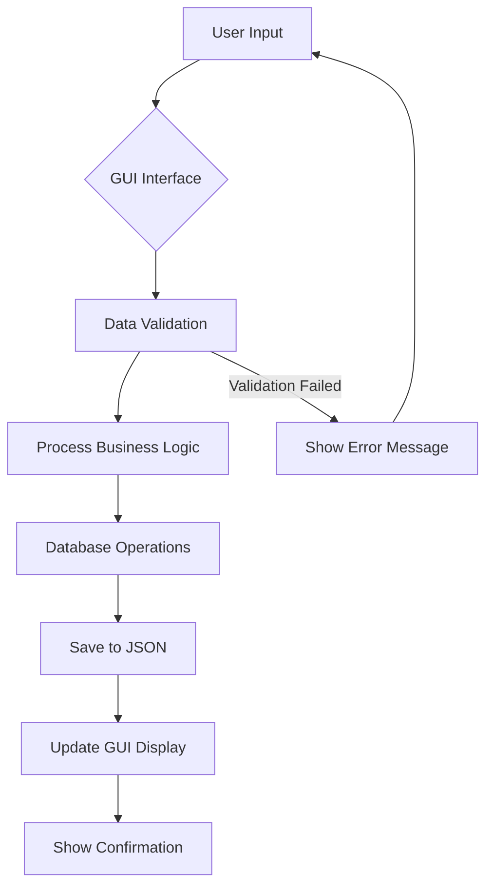

# 🎓 Student Management System

<div align="center">


**Sistem Manajemen Data Mahasiswa Modern dengan GUI PyQt5**

[Fitur](#-fitur) • [Instalasi](#-instalasi) • [Penggunaan](#-penggunaan) • [Dokumentasi](#-dokumentasi) 

</div>

## 📋 Daftar Isi

- [Gambaran Umum](#-gambaran-umum)
- [Fitur](#-fitur)
- [Instalasi](#-instalasi)
- [Penggunaan](#-penggunaan)
- [Dokumentasi](#-dokumentasi)
- [Konfigurasi](#-konfigurasi)
- [Contoh Penggunaan](#-contoh-penggunaan)
- [FAQ](#-faq)

## 🚀 Gambaran Umum

**Student Management System** adalah aplikasi desktop modern untuk mengelola data mahasiswa secara efisien. Dibangun dengan Python dan PyQt5, aplikasi ini menawarkan antarmuka yang intuitif dan fitur lengkap untuk administrasi akademik.

### ✨ Highlights

- 🎨 **GUI Modern** dengan PyQt5 dan styling profesional
- 💾 **Penyimpanan Otomatis** data dalam format JSON
- 🔍 **Pencarian Real-time** dengan filter advanced
- 📊 **Dashboard Statistik** data mahasiswa
- 📁 **Export Data** ke format JSON
- 🛡 **Validasi Data** komprehensif

## 🌟 Fitur

### 👨‍🎓 Manajemen Mahasiswa
- **Registrasi Mahasiswa** - Form lengkap dengan validasi
- **Edit Data** - Update informasi mahasiswa
- **Hapus Data** - Dengan konfirmasi keamanan
- **View Detail** - Tampilan informasi lengkap

### 🔍 Pencarian & Filter
- **Real-time Search** - Pencarian instan berdasarkan nama/NIM
- **Multiple Filters** - Filter berdasarkan program studi
- **Quick Access** - Akses cepat ke data yang dicari

### 💾 Manajemen Data
- **Auto-save** - Penyimpanan otomatis setiap operasi
- **JSON Storage** - Format data terstruktur
- **Backup & Export** - Ekspor data untuk backup
- **Data Validation** - Validasi input komprehensif

### 🎨 Antarmuka Pengguna
- **Modern GUI** - PyQt5 dengan material design
- **Responsive Layout** - Adaptif berbagai ukuran layar
- **Professional Styling** - Warna konsisten dan typography
- **User Friendly** - Navigasi intuitif dan mudah

### 📊 Laporan & Statistik
- **Real-time Stats** - Jumlah data terupdate
- **Data Summary** - Ringkasan informasi penting
- **Export Ready** - Siap untuk generate laporan

## 📥 Instalasi

### Prerequisites

- Python 3.6 atau lebih tinggi
- pip (Python package manager)

### Step-by-Step Installation

1. **Clone atau Download Repository**
   ```bash
   git clone https://github.com/username/student-management-system.git
   cd student-management-system
   ```

2. **Buat Virtual Environment (Recommended)**
   ```bash
   python -m venv student_env
   source student_env/bin/activate  # Linux/Mac
   student_env\Scripts\activate    # Windows
   ```

3. **Install Dependencies**
   ```bash
   pip install PyQt5
   ```

4. **Verifikasi Instalasi**
   ```bash
   python main.py
   ```

### Quick Install (Windows)
```bash
# Download dan ekstrak project
python main.py
```

### Requirements
```txt
PyQt5>=5.15.0
```

## 🎮 Penggunaan

### Menjalankan Aplikasi

```bash
python main.py
```

### Basic Usage

1. **Menambah Mahasiswa Baru**
   - Isi form di panel kiri
   - Klik "Simpan Data"
   - Data otomatis tersimpan dan muncul di daftar

2. **Mencari Mahasiswa**
   - Gunakan search bar di panel kanan
   - Ketik nama atau NIM
   - Hasil update real-time

3. **Mengelola Data**
   - Pilih mahasiswa dari daftar
   - Klik "Lihat Detail" untuk informasi lengkap
   - Klik "Hapus" untuk menghapus data

### Keyboard Shortcuts

| Shortcut | Action |
|----------|--------|
| `Ctrl + N` | Form baru |
| `Ctrl + S` | Simpan data |
| `Ctrl + F` | Focus search |
| `Ctrl + E` | Export data |
| `Ctrl + Q` | Keluar aplikasi |

## 📚 Dokumentasi

### Architecture Overview

```
Student Management System
├── Presentation Layer (PyQt5 GUI)
├── Business Logic Layer (Student Manager) 
├── Data Access Layer (JSON Database)
└── Configuration Layer (Settings)
```

### Workflow Diagram



### Komponen Utama

#### Core Classes
- **`StudentManagementSystem`** - Main application window
- **`StudentManager`** - Business logic handler
- **`DatabaseManager`** - Data persistence layer

#### GUI Components
- **Form Widgets** - Input fields, combobox, calendar
- **List Display** - QListWidget untuk menampilkan data
- **Search Functionality** - Real-time search implementation
- **Dialog Boxes** - Confirmation and information dialogs

---

### File Descriptions

| File | Description |
|------|-------------|
| `main.py` | Entry point, menginisialisasi dan menjalankan aplikasi |
| `student_manager.py` | Logic bisnis untuk manajemen data mahasiswa |
| `database_handler.py` | Menangani operasi database dan penyimpanan |
| `config.py` | Konfigurasi aplikasi, styling, dan settings |

## ⚙️ Konfigurasi

### Customization

Edit `config.py` untuk menyesuaikan aplikasi:

```python
# Application Configuration
APP_CONFIG = {
    "app_name": "Student Management System",
    "version": "2.0",
    "default_font": "Segoe UI",
    "window_size": (900, 700),
    "min_window_size": (800, 600)
}

# Color Scheme Customization
STYLE_CONFIG = {
    'primary_color': '#4f46e5',      # Warna utama
    'secondary_color': '#6b7280',    # Warna sekunder
    'background_color': '#f0f2f5',   # Warna background
    'card_background': '#ffffff'     # Warna kartu
}

# Validation Rules
VALIDATION_RULES = {
    'name_min_length': 2,
    'name_max_length': 100,
    'nim_min_length': 3,
    'nim_max_length': 20
}
```

### Theme Customization

```python
# Dark Theme Example
DARK_THEME = {
    'bg_dark': '#1a1a1a',
    'bg_light': '#2d2d2d',
    'text_light': '#ffffff',
    'accent': '#bb86fc'
}
```

## 💡 Contoh Penggunaan

### Basic Data Management

```python
# Menambah mahasiswa baru
student_data = {
    'name': 'Ahmad Rizki',
    'nim': '202407001',
    'birth_date': '15/08/2000',
    'program_study': 'Computer Science',
    'gender': 'Male'
}

# Simpan ke database
manager = StudentManager()
result = manager.add_student(**student_data)
print(f"Mahasiswa {result['name']} berhasil ditambahkan!")
```

### Advanced Search

```python
# Pencarian mahasiswa
search_results = manager.search_students('Ahmad')
for student in search_results:
    print(f"{student['name']} - {student['nim']}")
```

### Data Export

```python
# Export data ke file
export_result = manager.export_data('backup_2024.json')
if export_result:
    print("Data berhasil diexport!")
```

## ❓ FAQ

### Q: Apakah data tersimpan otomatis?
**A:** Ya! Semua data secara otomatis tersimpan ke file JSON.

### Q: Bisakah import data dari Excel?
**A:** Untuk sekarang tidak bisa.

### Q: Berapa banyak data yang bisa ditangani?
**A:** Aplikasi optimal untuk hingga 10,000 record mahasiswa.

### Q: Apakah support multi-user?
**A:** Saat ini single-user.

### Q: Bagaimana backup data?
**A:** Gunakan fitur export untuk backup manual, atau copy file `students.json`.

<div align="center">

**⭐ Jangan lupa beri bintang jika project ini membantu! ⭐**

[Kembali ke Atas](#-student-management-system)

</div>